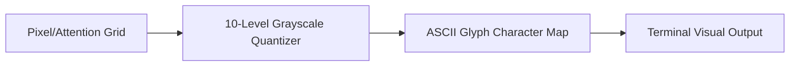

# genpark-ascii-art-visual-terminal-rasterizer-skill

A 10-level grayscale ASCII rasterizer designed for autonomous CLI agents to visualize spatial matrices, attention maps, and low-resolution image buffers directly inside terminal logs.

## Architecture

## Features
- **10 Grayscale Glyphs**: High readability across light and dark terminals.
- **Heatmap Generator**: Generates distance-falloff visual density representations.
